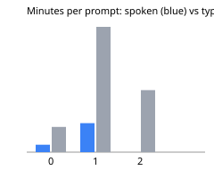
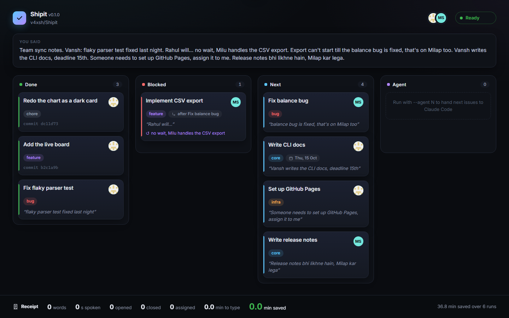

<!-- chart -->


| Prompt | Words | Spoken (min) | Typed (min) | Saved (min) |
|---:|---:|---:|---:|---:|
| 0 | 165 | 1.2 | 4.1 | 2.9 |
| 1 | 820 | 4.8 | 20.5 | 15.8 |
| 2 | 406 | 2.6 | 10.2 | 7.6 |
| 3 | 266 | 1.7 | 6.7 | 4.9 |
| 4 | 288 | 1.6 | 7.2 | 5.6 |
| 5 | 325 | 1.8 | 8.1 | 6.3 |
| 6 | 256 | 1.7 | 6.4 | 4.7 |
| **Total** | **2526** | **15.4** | **63.2** | **47.8** |
<!-- /chart -->



# Shipit

**Say it. It's tracked. It's started.**

**Demo video:** [Watch the demo](https://www.youtube.com/watch?v=3wO73nH2L4Y)

Shipit is a command-line tool for developers. Instead of typing a standup, you talk, and it ships:
GitHub issues with labels, owners, deadlines and dependencies, a live board in your browser, and
Claude Code agents that turn your next issues into pull requests.
**[Docs site](https://v4xsh.github.io/Shipit/)** · **[Voice log](voice-log.md)**

## Try it in 2 minutes

```sh
pip install git+https://github.com/v4xsh/Shipit   # Python 3.10+, no other dependencies
shipit --replay                                   # the demo board: three recorded standups, no keys
```

If `shipit` isn't found (pip's Scripts folder isn't on PATH on many Windows setups), every command
works as `python -m shipit` too.

For real, inside any repo with a GitHub `origin`:

```sh
gh auth login                                 # once
echo GROQ_API_KEY=gsk_your_key >> .env        # free key from console.groq.com; keep .env gitignored
shipit                                        # dictate with Wispr Flow, empty line to finish
```

You say: *"Kal maine login fix kiya. Milap takes the balance bug by Friday, actually make that
Thursday. Docker setup, scratch that."* The board fills, you answer **yes** on the confirm card,
and the issues are on GitHub, each ending with `Said: "<your exact words>"`.

## Commands

| Command | What it does |
|---|---|
| `shipit` | The standup: drafts done items from your commits, listens, shows the board, confirms, ships to GitHub, prints the receipt |
| `--text "..."` | Say it as an argument instead of dictating |
| `--from-notes FILE` | A meeting transcript: issues for everyone mentioned |
| `--dry-run` | Print the `gh` commands instead of running them |
| `--agent N` | Claude Code works your top N next issues in parallel worktrees, tests, pushes, opens PRs |
| `--debug` | Ramble about a bug; one agent per hypothesis confirms or rules it out; "fix it" opens the PR |
| `--review PR` | Speak a review; it's posted, an agent addresses it, "merge" merges |
| `--replay` | The demo board from recorded standups |
| `--no-board`, `--port N` | Terminal only, or pick the board's port |
| `--version` | Print the version |

Every flag, with examples: [docs/commands](https://v4xsh.github.io/Shipit/commands.html).

**If something fails, it's one line, never a traceback.** If GitHub is unreachable or `gh` is
missing or logged out, the issues come out as Markdown and go on your clipboard. If Groq is down or
rejects the key, the keyword splitter takes over. If Claude Code is missing, no branches are created.
If you're offline, Shipit says so once at the start and goes straight to those fallbacks. Anything
else is one line, with details in `.shipit/crash.log`.

## From a meeting

Standups often happen in a call, not at your desk. `--from-notes` takes the meeting transcript and
does the same thing: one confirm card, issues for **everyone** mentioned, each quoting what was said.

```sh
shipit --from-notes examples/meeting.md --dry-run   # see the plan, nothing written
shipit --from-notes examples/meeting.md             # yes on the card, and it's on GitHub
```

[Wispr Flow's Notetaker](https://wisprflow.ai) is the natural source. Its MCP server is Mac only today,
so on Windows you export the meeting notes and pass the file. Speaker labels (`**Milap:** ...`)
matter: "main kar dunga" on Milap's line is Milap's work, not yours.
[`examples/meeting.md`](examples/meeting.md) is a two-person standup between Vansh and Milap.
It gives both of them issues: Vansh's mobile fix by Friday; Milap's webhook retries, his Groq-tier
blocker and the release notes ("by Monday, actually make that Tuesday") that wait on the mobile fix.

## How it works

1. **Speak.** Shipit finds the repo and team (`gh`), drafts your done list from `git log`, and
   listens. English or Hinglish, corrections and all: "scratch that", "assign it to me",
   "actually make that Friday", "Milap blocks on Render".
2. **Parse.** Groq (`openai/gpt-oss-120b`, temperature 0, JSON) turns it into done / blocked /
   next items with a label (bug, feature, infra, core, chore), an assignee (fuzzy-matched to a
   collaborator login), a deadline, dependencies, and the exact words said. Bad JSON gets one
   retry, then a keyword splitter, so it never dies on camera.
3. **Board.** A local page, one HTML file with no framework, updated over server-sent events.
   Cards slide in, scratched cards strike and fade, reassigned avatars flip, deadlines pulse.
4. **Confirm.** Yes, edit (say the fix) or no. Nothing touches GitHub before yes.
5. **Ship.** Issues, labels, `Due <date>` milestones, `Blocked by` / `Blocks` links, no
   duplicates of open issues (even reworded), done items closed, a dated "Shipit log" comment.
6. **Receipt and workload.** Minutes saved against typing at 40 wpm, a running total, and a
   heads-up if someone carries clearly more ("docs wala Milap ko de do" moves one).
7. **Agents.** `--agent`, `--debug` and `--review` run `claude -p` in their own git worktrees,
   stream every step to the terminal and the board, and only push work whose tests pass.

## How this was built

Shipit was built by voice: every prompt was dictated with Wispr Flow into Claude Code, and
**the mouse and Enter were used only for approvals.** Each prompt is in the voice log word for
word, slips and all, with seconds spoken against typing time at 40 wpm. That's the chart at the top.

<!-- stats -->
**9 voice prompts → 31 commits → 117 tests.** [Read the voice log](voice-log.md), word for word.
<!-- /stats -->

The Wispr Flow account used for this build was created through the HH Goa (Hacker House Goa)
referral, and its history matches [voice-log.md](voice-log.md), prompt for prompt.
Every commit ends with the voice prompt that asked for it (`Voice prompt: 6`), including the commits
written by Shipit's own agents. Stdlib only, Windows first, UTF-8 everywhere. The
[Built by voice page](https://v4xsh.github.io/Shipit/built-by-voice.html) renders the whole log.

## Notes for the Wispr team

Five real friction points from dictating this whole build into Claude Code, straight from the
[voice log](voice-log.md):

1. **Product names lose to common words.** Groq came out as "Grok" ten times across four prompts
   ("Grok returns bad JSON", "Grok key is in .env"), even in the prompt asking for this list
   ("Grok heard as Grok"). Render came out as "Tender", and my teammate Milap as "Milab". Every one
   is a name the repo already knew.
2. **Dev jargon becomes nonsense.** "dedupe" was heard as "Did up" and later "Video by normalized
   title", "chore" as "CHO R1", "worktrees" as "working trees", and "receipt" as "A script printed"
   and "speed received". Claude had to guess, and once I needed a whole extra sentence to fix one word.
3. **Flags and code lose their shape.** `--agent 1` became `-agent 1`, `claude -p` became
   `claude-p`, and `shipit/issue-<n>` became `shipit/issue/-number`. In a terminal, `--` and spaces
   are the meaning.
4. **Homophones flip the spec.** "blocked" came out as "logged" and "blogged", "Said:" as "set:",
   and "quotes the spoken line" as "codes the spoken line". Each one passes a spell-checker and quietly
   changes what gets built.
5. **Lists and sending.** A spoken outline arrived numbered twice ("37. 1. repo, team, and state"),
   and each prompt still ended with an Enter to send it.

What would have helped most:
- **A repo dictionary**, learned from the open project: README words, file names, package names
  and `gh` collaborators. That covers Groq, Render, Milap, dedupe, worktree and chore in one go.
- **A spoken "send it"** (and a code-aware mode for terminals that keeps `--flags` and backticks),
  so the last Enter goes away too.

## Run the tests

```sh
git clone https://github.com/v4xsh/Shipit && cd Shipit
python -m unittest                # gh, Groq and Claude are mocked; recorded model replies
git config core.hooksPath hooks   # pre-commit: chart, README numbers, docs voice page
python tests/record.py            # re-record the model replies from real Groq (needs .env)
python docs/shots.py              # re-take the docs screenshots with headless Edge
```
